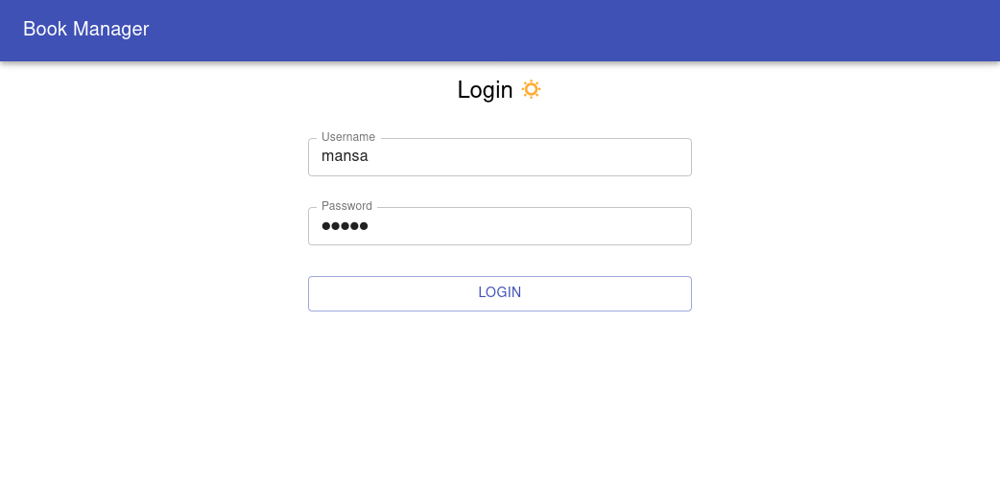

# Book Store management frontend

Full stack project made for getting hands on practice on React and Spring Boot. [Frontend part]

## Technologies

* Fetch/Axios
* Material UI
* React Table
* React Toastify
* React CSV
* Jest (testing)
* Enzyme (testing)
* Enzyme adapter react (unofficial)

## Screenshots

## Credit

🔥 Happy coding!